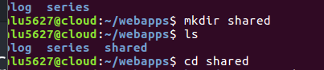
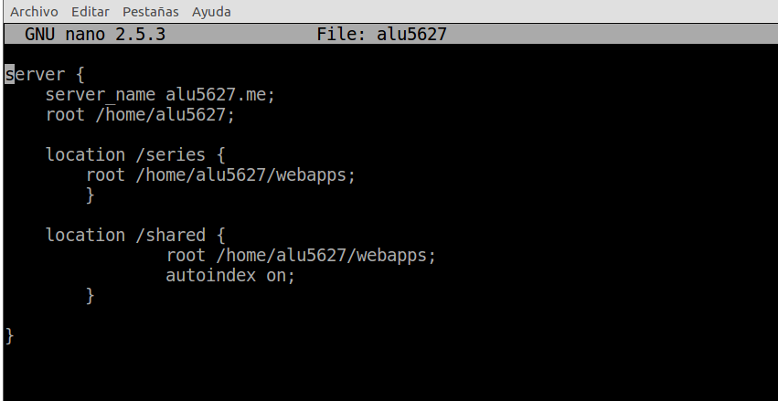
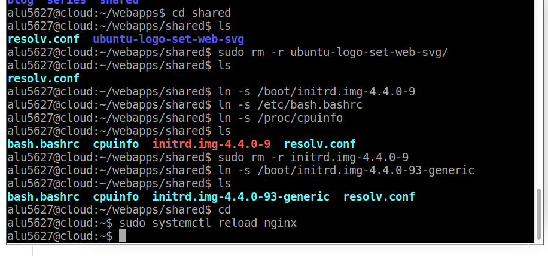
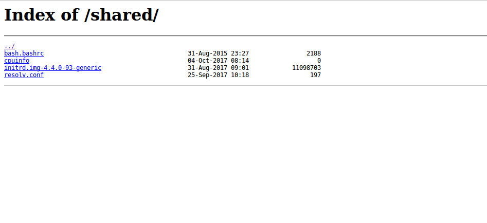

# Listado de directorios

En esta práctica utilizaremos **autoindex** y nos permite listar el contenido del directorio actual, pudiendo implementar una especie de **FTP** a través del navegador.

Creadmos el dirrectorio Shared en webapps y nos situamos en el.

Ahora vamos a crear un virtual host para servir esta carpeta compartida shared con el siguiente comando:
cd etc/nginx/sites-available y luego sudo nano alu5627

Enlazamos los directorios en el virtual host para que estén disponibles

Ahora recargamos el servidor para que los cambios tengan efecto:

Y comprobamos que funciona todo correctamente.

