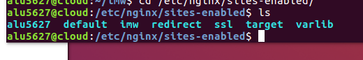

# UT1-A3: Trabajo con virtual hosts

Vamos a configurar 4 sitios web (virtual hosts) en nuestro servidor web Nginx.

## Sitio web 1

### Parte 1

Vamos a mostrar una página con la imagen de "Diagrama de unidades de trabajo"

Primero vamos a crear un fichero llamado imw en **sites-available**  y lo modificamos para que nos salga el contenido que hay en la carpeta. Luego creamos el enlace simbolico en **sites-enabled** y actualizamos **"sudo systemctl restart nginx"**.

Nos bajamos la imagen en la máquina real y luego la movemos a la máquina de producción con el comando **scp**

Creamos el index.html dentro de **imw** para visualizar la img.

Actualizamos los cambios y comprobamos:

Vemos que la imagen se nos ve perfectamente.

### Parte 2

Ahora vamos mostrar una página con un enlace al Real decreto del título de Administración de Sistemas Informáticos.

Creamos el directorio **/mec** situandolo en el directorio imw y añadimos un location en el fichero **imw** en **sites-available**  y luego actualizamos **"sudo systemctl restart nginx"**.

Nos bajamos en la máquina real el pdf y luego lo pasamos a la máquina de producción con el comando **scp**  en el directorio **/imw/mec** :

En el index.html ponemos el enlace al pdf

Actualizamos y comprobamos:

Aqui nos muestra el enlace al fichero pdf :

## Sitio web 2

Vamos mostrar ahora el listado de ficheros y directorios de **/var/lib** de la máquina de producción.

Para eso creamos el siguiente fichero **varlib** en **sites-available** hacemos el enlace simbólico en **sites-enabled** y actualizamos:   

Como podemos ver nos sale toda la información del directorio de **/var/lib**

## Sitio web 3

Vamos mostrar una página web que nos pida usuario y contraseña con el nombre de todo el alumnado de clase y el certificado de seguridad ssl.

Creamos el dirrectorio students

Vamos al archivo **ssl** en **sites-available** y añadimos la config para students, para que nos pida usuario-contraseña y prohibir explícitamente el acceso al fichero .htpasswd

Creamos el fichero **.htpasswd** en el directorio /students usando los siguientes comandos :

Para encriptar la contraseña "aula108"

**perl -le 'print crypt("aula108", "salt-hash")'**

 echo **"usuario1:saePqpXJa/sVk" > .htpasswd**

Comprobamos con contraseña y usuario

Y como podemos ver funciona correctamente:

## Sitio web 4

**Redirecciones**

Se debe redirigir cualquier petición de esta dirreción http://redirect.alu5627.me a http://target.alu5627.me

http://redirect.alu5627.me/test/ -> http://target.alu5627.me
http://www.redirect.alu5627.me/probando/ -> http://target.alu5627.me
http://www.redirect.alu5627.me/hola/ -> http://target.alu5627.me

Creamos el fichero redirect con la siguiente config:

Creamos el fichero target con la siguiente config:

Y creamos el enlace simbolico target

Movemos el contenido de initializr de la máquina real a la máquina de producción con el comando **scp** y con esto mostraremos en http://target.alu5627.me su contenido.

Creamos el directorio redirect en /var/log/nginx para tener estas rutas :

    /var/log/nginx/redirect/access.log
    /var/log/nginx/redirect/error.log

Entramos en el dominio http://redirect.alu5627.me y vemos que nos redirecciona a http://target.alu5627.me

