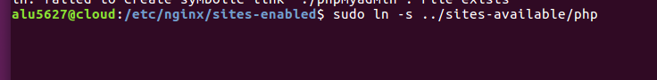
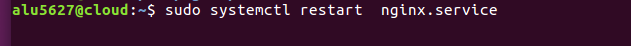
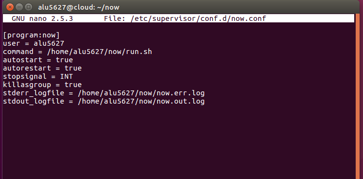

# Sirviendo aplicaciones Php y Python

Enlace php:  http://php.alu5627.me

Enlace python: http://now.alu5627.me

## Sitio web 1

Primero nos descargamos el archivo **demo_php.zip** en la maquina real y luego
lo movemos a la máquina de producción con el siguiente comando:

Creamos el directorio php y dentro de este utilizamos el siguiente comando para descomprimir el archivo:

A continuación vamos a crear un nuevo archivo en sites-available llamado php con la siguiente configuración:

Luego hacemos el enlace simbolico.  

Reiniciamos el sistema nginx:

Vamos a comprobar que poniendo la dirrecion http://php.alu5627.me nos sale el contenido de **demo_php** correctamente.

## Sitio web 2

Vamos a crear un entorno virtual para **now** y luego lo vamos a activar :

Ahora vamos a instalar un mini-framework de desarrollo web denominado flask

A continuación creamos un pequeño fichero en python que va a contener el código de la aplicación web:

Lanzamos el proceso para comprobar que va correcto hasta el momento:

Creamos un fichero de configuración para **UWSGI**:

Ahora tenemos que crear un pequeño script que será el encargado de activar el entorno virtual de nuestra aplicación y de lanzar el proceso uwsgi para que escuche peticiones en el socket especificado:

Le damos permisos de ejecución al script que hemos creado:

Vamos a crear un virtual host para nuestra aplicación python. Para ello creamos un archivo sites-available:

Creamos el enlace simbolico y reiniciamos el sistema:

Lanzamos nuestra aplicación UWSGI para que escuche en el socket especificado y devuelva el sencillo html que hemos preparado en nuestra aplicación python:

Para mantener nuestra aplicación "viva" y poder gestionar su arranque/parada de manera sencilla, necesitamos un proceso coordinador. Para este cometido, se ha desarrollado supervisor (nosotros ya lo tenemos instalado en nuestra máquina de producción).

Vamos a realizar el siguiente paso para que nuestro programa now sea gestionado por supervisor, tenemos que añadir un fichero de configuración:

Reiniciamos el servicio para que surtan efectos los cambios realizados y comprabamos el status de este:

Vemos que esta funcionando correctamente nuestra aplicación :

Y comprobamos entrando en la siguiente dirreción http://now.alu5627.me si funciona correctamente:

