# WordPress

Lo primero, si estamos trabajando con una máquina de producción con poca memoria RAM, en este caso, sólo 512MB, debemos activar el Swap para no tener problemas con los servicios.

Entramos en mysql.

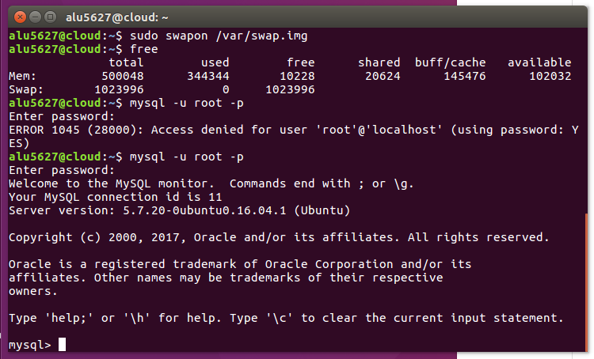

Creamos la base de datos, el usuario y asignamos privilegios:

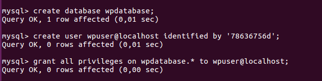

Descargamos el código fuente de Wordpress desde su página web:

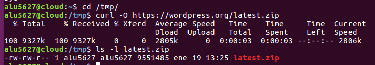

A continuación descomprimimos el código y lo copiamos en /usr/share:

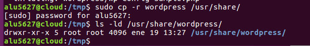

Ahora tenemos que establecer los permisos necesarios para que el usuario web www-data pueda usar estos ficheros:

Vamos a editar ficheros de configuración.

Debemos especificar el nombre de la base de datos, el usuario y la contraseña, para que Wordpress pueda usarlos:

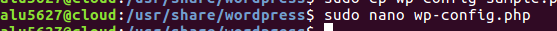

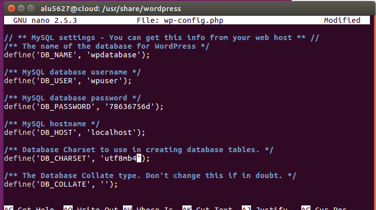

Para que nuestro sitio Wordpress sea accesible desde un navegador web, debemos incluir las directivas necesarias en la configuración del servidor web Nginx.

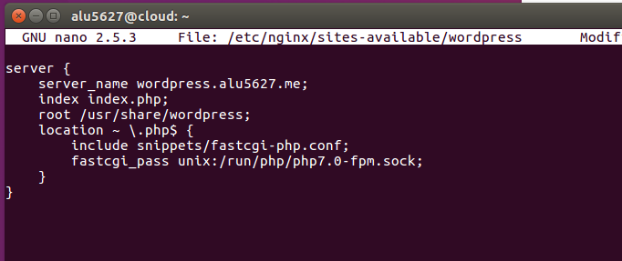

Enlazamos la configuración para que el virtual host esté disponible:

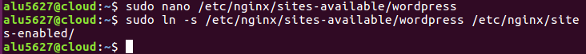

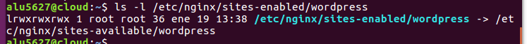

Reiniciamos el servicio Nginx:

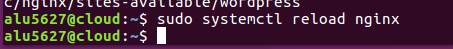

Ahora podemos acceder a la dirección de nuestro servidor para configurar nuestro Wordpress vía web.

Realizamos las configuraciones correspondientes:

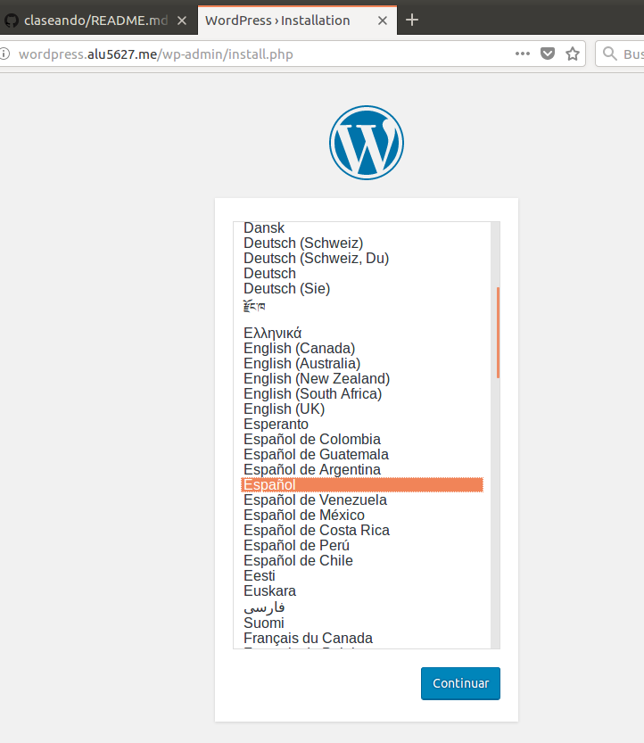

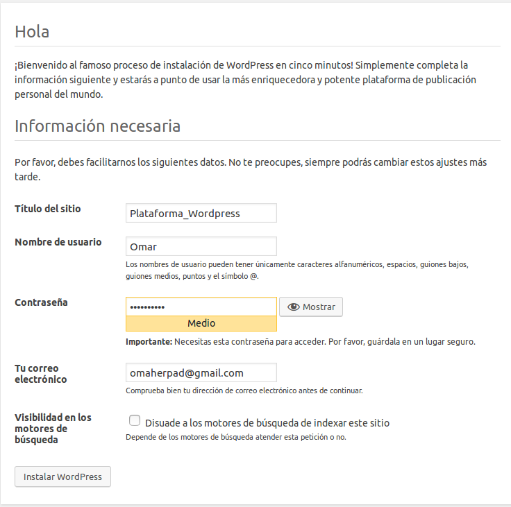

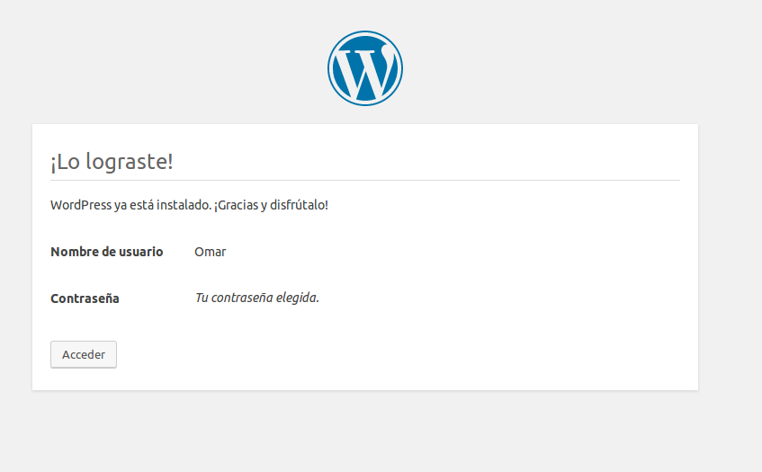

Accedemos a la interfaz administrativa de Wordpress tras inicio de sesión:

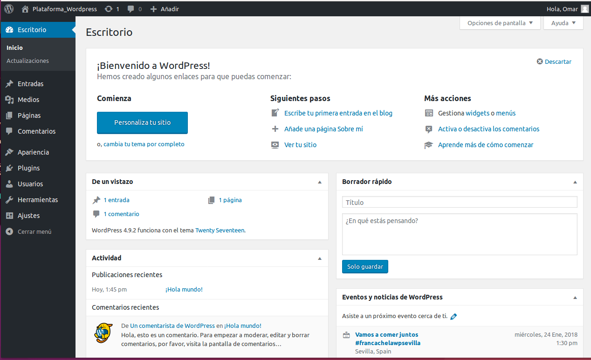

Por defecto, el límite de subida de archivos para aplicaciones PHP suele ser bastante bajo, en torno a los 2MB.

Para incrementarlo, debemos hacer lo siguiente, como root en la máquina de producción:

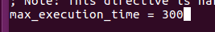

Ahora reiniciamos el servicio php-fpm:

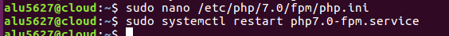

Además de esto, debemos añadir una línea en el fichero de configuración de Nginx y reiniciar el servicio:

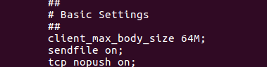

**Ajuste de permalinks**

En primer lugar activamos esta opción dentro de la interfaz administrativa de Wordpress:

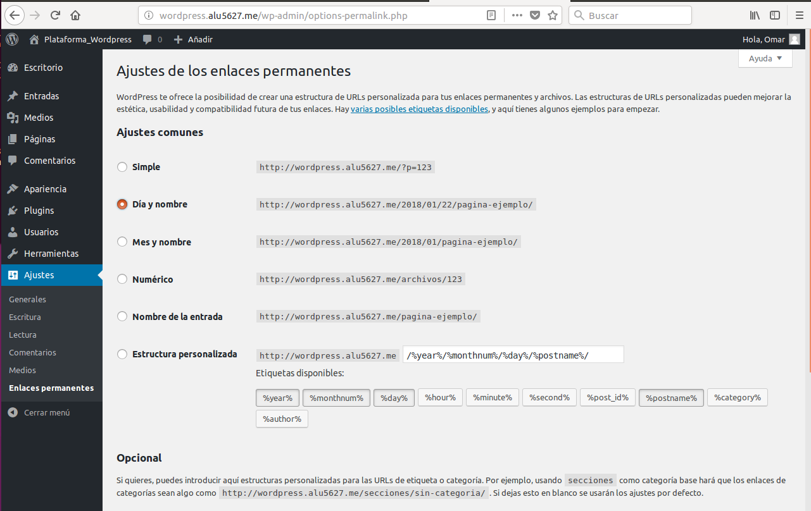

Ahora debemos indicar a Nginx que procese estas URLs:

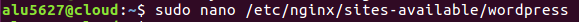

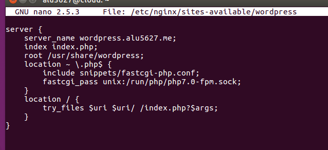

Entramos en nuestro **Wordpress**:

Instalamos y activamos un tema gratuito.

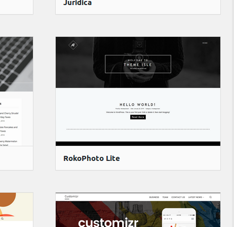

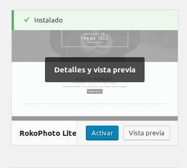

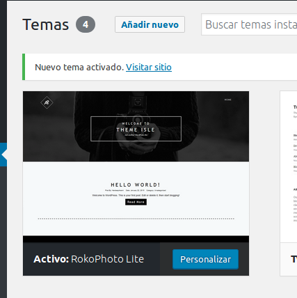

Escribimos un post con las estadísticas de uso de Wordpress vistas en clase y entramos a dicho post.

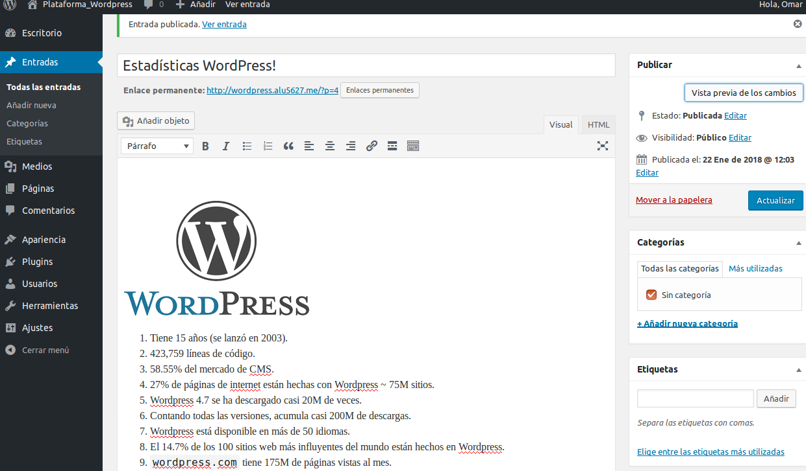

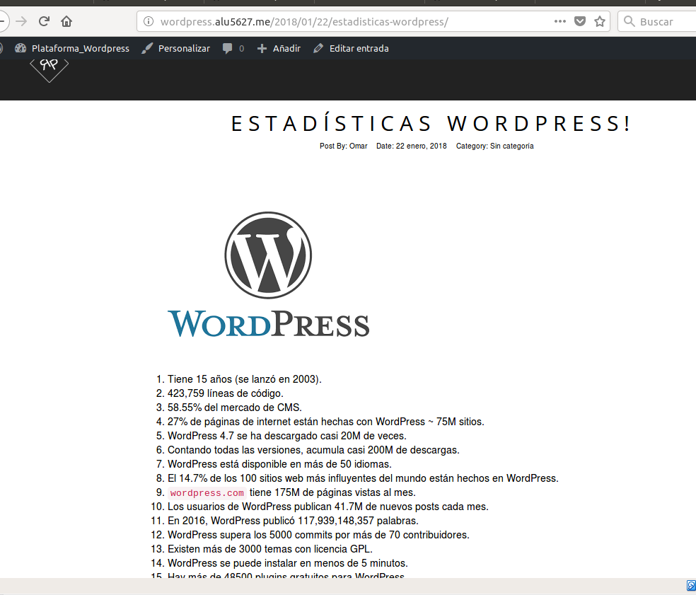
